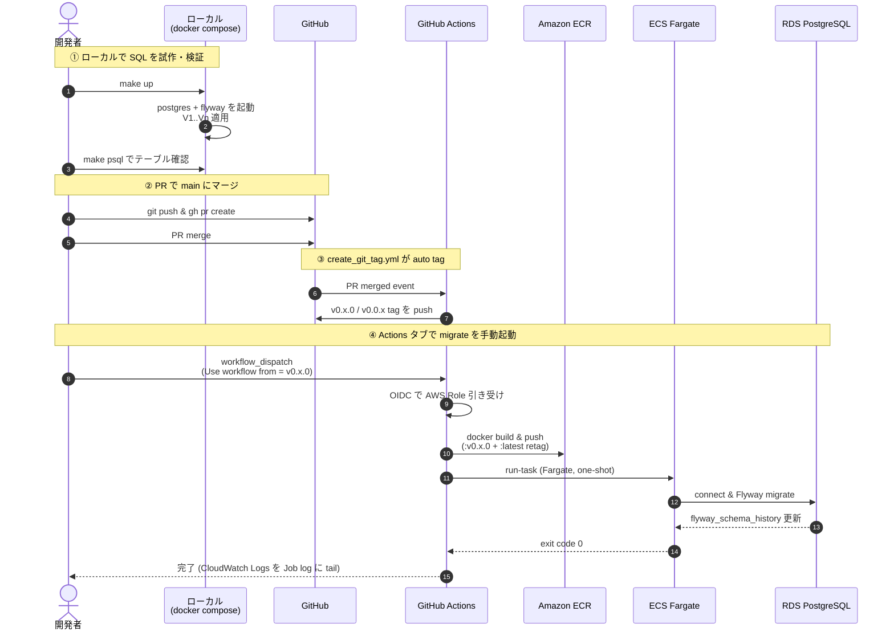
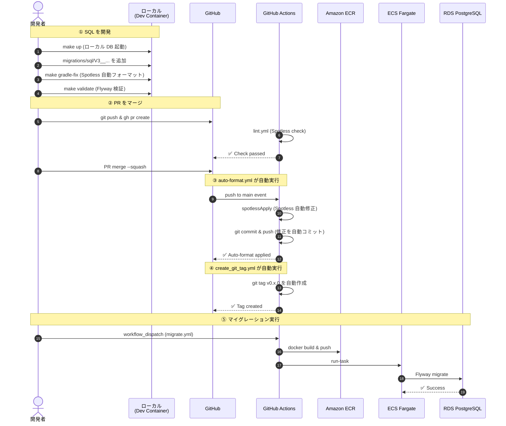
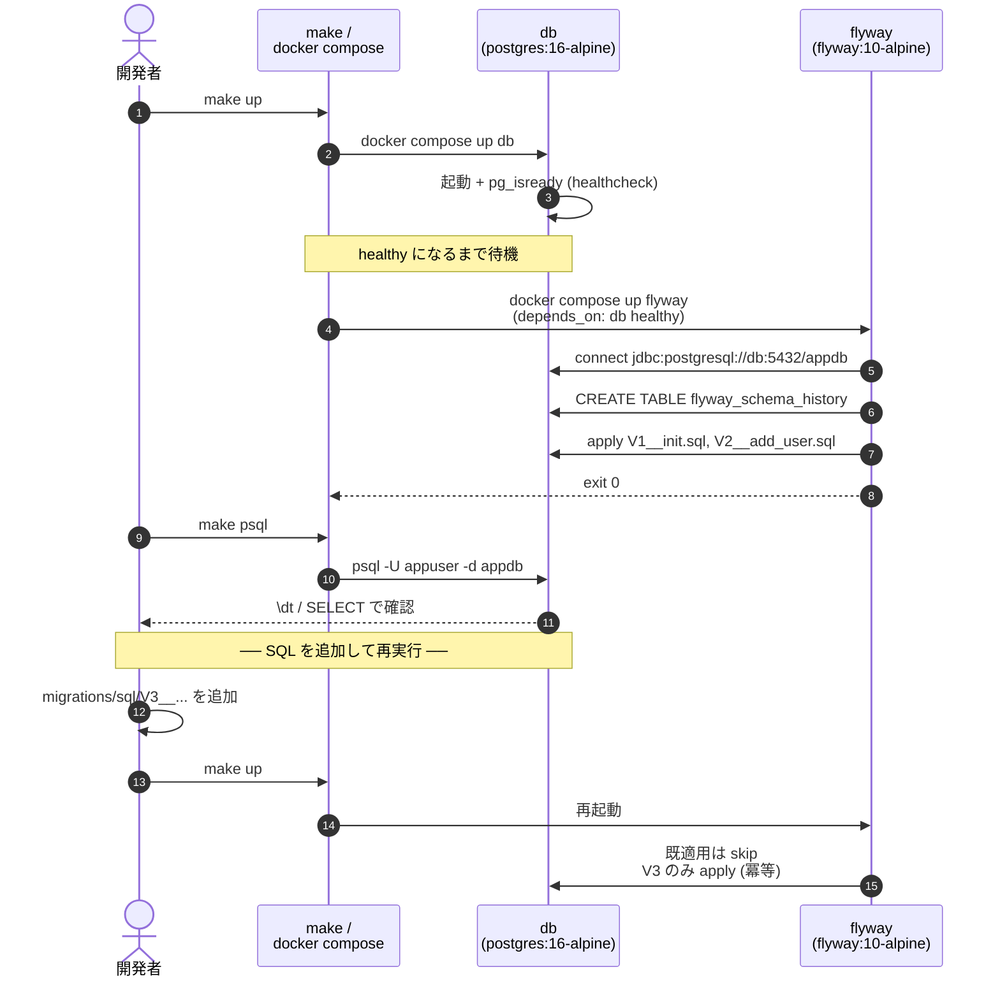

# ecs-migration-runner

ECS Fargate の **one-shot タスク** で RDS PostgreSQL に **Flyway マイグレーション**を実行する基盤。
**GitHub Actions** が **OIDC 認証**で AWS にアクセスし、長期 IAM アクセスキーは使わない。

## アーキテクチャ

詳細は [docs/architecture.md](docs/architecture.md) と [docs/architecture.drawio](docs/architecture.drawio) を参照。

```
Developer ─push→ GitHub ─OIDC→ AWS STS ─→ GitHubActionsRole
                                            │
                                            ├─ ECR (image push)
                                            └─ ECS RunTask (Fargate / one-shot)
                                                    │
                                                    │ Private Subnet
                                                    ├──→ RDS PostgreSQL (Flyway migrate)
                                                    ├──→ Secrets Manager (RDS credentials)
                                                    └──→ CloudWatch Logs
```

### 全体シーケンス



## 責務分担

| レイヤ | 担当 | タイミング |
|---|---|---|
| **インフラ** (VPC / RDS / ECS Cluster / Task Definition / ECR / IAM) | `infra/*.cfn.yaml` を **手動** で `aws cloudformation deploy` | 初回構築 / 構成変更時のみ |
| **マイグレーション資産** (SQL / Dockerfile) | Git で管理 (`migrations/sql/`, `docker/`) | 機能追加時 |
| **マイグレーション実行** | GitHub Actions (`migrate.yml`) **手動 workflow_dispatch** | リリースごと、PR merge → auto tag → tag 選択して起動 |

GitHub Actions は **インフラを作らない**。`describe-stacks` 等で CFN を読まないので、CFN 構成が変わっても workflow は影響を受けない（GitHub Variables を更新するだけで追従）。

## 運用フロー

### SQL 開発 → PR → マージ → 本番デプロイ



---

## Flyway マイグレーション仕組み詳解

### マイグレーション実行フロー

Flyway が **実行済みを記録・スキップする仕組み**を解説します。

```
┌─────────────────────────────────────────────────────────────────┐
│                  マイグレーション実行フロー                      │
└─────────────────────────────────────────────────────────────────┘

[Flyway 起動]
     │
     ├─→ ① DB 接続
     │    └─→ flyway_schema_history テーブルを確認（初回は作成）
     │
     ├─→ ② SQL ファイル一覧を読む
     │    └─→ V1__init.sql, V2__add_user.sql, V3__add_post.sql ...
     │
     ├─→ ③ 実行済み version を確認
     │    └─→ SELECT version FROM flyway_schema_history
     │        WHERE success = true
     │
     ├─→ ④ 未実行ファイルを判定
     │    └─→ V3__add_post.sql は未実行 → apply
     │        V1, V2 は既に history に記録 → skip（実行しない）
     │
     ├─→ ⑤ checksum 検証
     │    └─→ V1, V2 ファイルのチェックサムが一致？
     │        一致しない → エラー（ファイル内容が編集されている）
     │
     ├─→ ⑥ 未実行ファイルを順序通り実行
     │    └─→ BEGIN TRANSACTION
     │        CREATE TABLE post(...)  ← V3 の SQL を実行
     │        INSERT INTO flyway_schema_history
     │          (version, description, type, script, checksum, ...)
     │        VALUES (3, 'add post', 'SQL', 'V3__add_post.sql', ...)
     │        COMMIT TRANSACTION
     │
     └─→ ⑦ 完了
          └─→ exit code 0
```

### 冪等性（べきとう）と「実行しない」仕組み

Flyway の **最大の特徴**は **冪等性**です：

```
┌─────────────────────────────────────────────────────────────────┐
│                   冪等性とは（べきとう）                         │
│                                                                 │
│  同じ SQL を何度実行しても、結果が同じ状態になるプロパティ      │
│  「副作用がない」と言い換えることもできます                     │
└─────────────────────────────────────────────────────────────────┘

【例】マイグレーション履歴の遷移図

     DB: empty          DB: V1 済み       DB: V2 済み
     ┌──────┐          ┌──────┐         ┌──────┐
     │      │          │user  │         │user  │
     │ PG16 │          │table │         │post  │
     │ empty│          │      │         │table │
     └──────┘          └──────┘         └──────┘
         △                 △                 △
         │                 │                 │
    make up            make up          make up
    make up            make up          make up
    make up            make up          make up
    [3 回実行]         [3 回実行]       [3 回実行]
         │                 │                 │
         └─────────────────┴─────────────────┘
                        │
                        ▼
              同じ状態に到達（冪等）

  SQL は 1 回だけ実行。2 回目以降は skip される
  → ローカル開発で `make up` を何度実行してもエラーにならない
```

### 実行済み判定のロジック

```
┌────────────────────────────────────────────────────────────────┐
│  ローカルディスク              │  DB (flyway_schema_history)  │
│                              │                               │
│  migrations/sql/             │  version | description | ... │
│  ├─ V1__init.sql            │  --------|------------|---- │
│  ├─ V2__add_user.sql        │    1     | init       | ... │
│  └─ V3__add_post.sql        │    2     | add user   | ... │
│                              │    3     | add post   | ... │
│                              │                               │
│  Flyway の判定:              │                               │
│  ┌──────────────────────────┐│                               │
│  │ ローカルファイル version │  │  DB に記録済み？            │
│  │ ─────────────────────│──┤│  ─────────────────            │
│  │  V1       [checksum] │1 │ ← Yes (一致) → skip           │
│  │  V2       [checksum] │2 │ ← Yes (一致) → skip           │
│  │  V3       [checksum] │? │ ← No → apply                 │
│  └──────────────────────────┘│                               │
│                              │                               │
│                              └─────────────────────────────┘
```

### スキップ（baseline）の仕組み

既に運用中の DB に Flyway を後付けする場合、「既に適用済みの SQL は実行したくない」というケースがあります。このとき **Baseline** を使用します：

```
┌────────────────────────────────────────────────────────────────┐
│               Baseline で特定バージョンまでスキップ             │
└────────────────────────────────────────────────────────────────┘

【シナリオ】
  本番 DB が既に存在し、テーブルが手動で作成されている
  ↓
  これから V1 以降を Flyway で管理したい
  ↓
  でも V1__init.sql は実行したくない（既にテーブルがある）

【Baseline の役割】

  ローカルディスク                  DB
  ──────────────────               ────────────────────
  migrations/sql/                  flyway_schema_history
  ├─ V1__init.sql
  ├─ V2__add_col.sql               version │ type     │ ...
  └─ V3__add_table.sql             --------|----------|-----
                                     0      │ Baseline │ ← 「ここまで適用済み」
                                            │          │   と記録する
                                            │          │
  `make baseline-init`              →       0 を記録
  `make up` を実行
                                     ↓
                                   V1 は skip
                                   V2 を apply
                                   V3 を apply

  実行フロー:
  ┌──────────────────┐
  │  make up 実行    │
  └──────────┬───────┘
             │
             ├─→ DB 接続
             │
             ├─→ flyway_schema_history から version を読む
             │    → version 0 (Baseline) が記録されている
             │
             ├─→ ローカル SQL ファイルをチェック
             │    V1: 0 < 1 だけど version 0 > なので skip
             │    V2: version 未記録 → apply ✓
             │    V3: version 未記録 → apply ✓
             │
             └─→ 完了（V1 は実行されていない）
```

### checksum エラーの検知

既存 SQL ファイルを **編集すると** checksum が不一致になり、Flyway がエラーを出します。これはデータ破損を防ぐための仕組みです：

```
┌─────────────────────────────────────────────────────────────┐
│          checksum 不一致エラーの検知メカニズム               │
└─────────────────────────────────────────────────────────────┘

【初回実行】
  V1__init.sql の内容:
  ┌──────────────────┐
  │CREATE TABLE user│
  └──────────────────┘
        │
        └─→ SHA256(内容) = abc123def456...
              ↓
         DB に記録 (flyway_schema_history)
         version=1, checksum=abc123def456...

【2 回目実行】
  V1__init.sql の内容（編集後）:
  ┌──────────────────┐
  │CREATE TABLE user │
  │ ADD COLUMN id;   │ ← 編集された！
  └──────────────────┘
        │
        └─→ SHA256(内容) = xyz789abc123...
              ↓
         DB から checksum を読む
         → abc123def456... （記録済み）
         ↓
         新 checksum = xyz789abc123...
         ↓
         ⚠️ 不一致 → エラー

  エラー メッセージ:
  ┌──────────────────────────────────────────┐
  │ Validate failed: Checksum mismatch for   │
  │ migration V1__init.sql                   │
  │ DB has: abc123def456...                  │
  │ File has: xyz789abc123...                │
  │                                          │
  │ → 既に実行済みの SQL を編集してはいけない │
  │ → 変更が必要なら新規 migration を追加    │
  └──────────────────────────────────────────┘
```

**対応方法：**

```bash
# ❌ やってはいけない（データ破損の危険）
vim migrations/sql/V1__init.sql  # 既存ファイルを編集

# ✅ 正しい方法
cat > migrations/sql/V1.1__fix_user_table.sql <<'SQL'
-- V1 で実装したテーブル定義を修正
ALTER TABLE "user" ADD COLUMN ...;
SQL

make up  # V1.1 のみ実行される（V1 は skip）
```

### ローカルでのスキップ・リトライ

```
┌────────────────────────────────────────────────────────────────┐
│  ローカル開発での「やり直し」パターン                           │
└────────────────────────────────────────────────────────────────┘

【パターン 1】中断したマイグレーションを再開

  make up
  ↓
  [エラー発生して失敗]  ← DB は部分的に適用（トランザクション中止）
  ↓
  [修正して再実行]
  make up
  ↓
  → 前回失敗した分から再実行される（スキップではなく再実行）


【パターン 2】DB をリセットしてやり直し

  make reset  # data volume ごと削除（完全初期化）
  ↓
  make up     # V1 から再実行
  ↓
  → flyway_schema_history がクリアされたので全 version 実行


【パターン 3】本番環境でのリトライ（一度だけ）

  v0.1.0 を本番に適用 → エラーで失敗
  ↓
  V3__add_column.sql を修正
  ↓
  v0.1.1 を新規作成（git tag）
  ↓
  migrate.yml で v0.1.1 を実行
  ↓
  → ECS one-shot は新規タスク起動
  → 失敗した v0.1.0 分は skip
  → v0.1.1 の新規 SQL のみ実行
```

---

## クイックスタート

### 1. インフラをデプロイ (初回 or 構成変更時のみ、手動)

```sh
# AWS CLI の認証は事前に設定 (aws configure / SSO 等)

# (1) Network + Data 層 (約 10 分、RDS 作成)
aws cloudformation deploy \
  --stack-name migration-network-data \
  --template-file infra/network-data.cfn.yaml \
  --capabilities CAPABILITY_NAMED_IAM

# (2) App 層 (約 2 分、ECR + ECS + IAM)
aws cloudformation deploy \
  --stack-name migration-app \
  --template-file infra/app.cfn.yaml \
  --capabilities CAPABILITY_NAMED_IAM \
  --parameter-overrides \
      GitHubOrg=YOUR_ORG \
      GitHubRepo=ecs-migration-runner
```

> OIDC Provider がアカウントに既にある場合は `CreateOIDCProvider=false` を追加。

### 2. GitHub リポジトリ設定

`Settings → Secrets and variables → Actions` で以下を登録:

| 種別 | 名前 | 値 (例) |
|------|------|----|
| **Secret** | `AWS_ROLE_ARN` | `migration-app` スタックの `GitHubActionsRoleArn` 出力 |
| Variable | `AWS_REGION` | `ap-northeast-1` |
| Variable | `ECR_REPOSITORY` | `flyway-migration` |
| Variable | `ECS_CLUSTER` | `migration-runner` |
| Variable | `ECS_TASK_FAMILY` | `flyway-migration` |
| Variable | `ECS_SUBNETS` | `subnet-aaa,subnet-bbb` (private subnet をカンマ区切り) |
| Variable | `ECS_SECURITY_GROUPS` | `sg-xxx` |
| Variable | `ECS_LOG_GROUP` | `/ecs/flyway-migration` |
| Variable | `ECS_LOG_STREAM_PREFIX` | `flyway` (タスク定義の `awslogs-stream-prefix` と一致させる) |

### 3. 運用フロー (PR → auto tag → migrate)

```
[作業ブランチ]
  feature/add-post-table
    └─ migrations/sql/V3__add_post.sql を追加
                ↓ PR
[main]
    └─ merge
                ↓ create_git_tag.yml が自動実行
[tag] v0.2.0 (bugfix/* なら patch、それ以外は minor)
                ↓ Actions タブで migrate workflow を手動起動
                ↓   Use workflow from = v0.2.0
[ECR push + ECS run-task]
    └─ Flyway がその tag 時点の SQL を適用
```

実行コマンド例 (CLI):

```sh
# 1. SQL を追加して PR
git checkout -b feature/add-post-table
cat > migrations/sql/V3__add_post.sql <<'SQL'
CREATE TABLE IF NOT EXISTS "post" (
    id         UUID NOT NULL DEFAULT gen_random_uuid(),
    user_id    UUID NOT NULL REFERENCES "user"(id),
    body       TEXT NOT NULL,
    created_at TIMESTAMPTZ NOT NULL DEFAULT CURRENT_TIMESTAMP,
    CONSTRAINT post_pkey PRIMARY KEY (id)
);
SQL
git add migrations/sql/V3__add_post.sql
git commit -m "feat(migration): add post table"
git push -u origin feature/add-post-table
gh pr create --base main --title "feat: add post table" --body "..."

# 2. PR を merge → create_git_tag.yml が走り、v0.2.0 が打たれる
gh pr merge --squash --delete-branch

# 3. 新タグで migrate を起動
gh workflow run migrate.yml --ref v0.2.0
gh run watch
```

## ローカル開発

ローカル開発には **2 つのモード** があります。どちらでも動作確認できます。

### 必要なもの

| 項目 | macOS | Windows | Linux |
|-----|-------|---------|-------|
| Docker Desktop | ✅ | ✅ | Docker CE |
| make | ✅ (標準) | ⚠️ WSL2 推奨 | ✅ (標準) |
| VSCode | オプション | オプション | オプション |

**Windows での make コマンド:**
- **推奨**: WSL2 + Ubuntu で実行
- または Git Bash（`make` をインストール）
- または `docker compose` コマンド直接実行

#### 環境自動判定

Makefile が OS を自動判定します：

```bash
make os-check  # 検出環境を表示
```

### モード A: ローカル Compose（シンプル）

`docker-compose.yml` を使用。PostgreSQL + Flyway のみで、Gradle はローカル環境に依存。

```bash
make up                # PostgreSQL + Flyway 起動
make spotless-fix      # SQL フォーマット（ローカル Gradle があれば）
make psql              # DB 接続
make down              # コンテナ停止
```

**利点**: シンプル、低リソース  
**欠点**: Gradle のインストール必要（Windows では手間）

---

### モード B: Dev Container（推奨・クロスプラットフォーム）

VSCode で `.devcontainer/` を使用。Java + Gradle + PostgreSQL + Flyway を完全統合。

```bash
# VSCode で以下のいずれかを実行
make devcontainer-up        # Dev Container を開く（推奨）
# または手動で "Dev Containers: Open Folder in Container" コマンド実行
```

#### Dev Container 内での開発フロー

```bash
# PostgreSQL + Flyway が自動起動されます（初回は数十秒待機）

# SQL をフォーマット
make gradle-fix              # Dev Container 内で Spotless Apply

# DB の状態確認
make info                    # マイグレーション一覧
make psql                    # psql で接続

# テーブル確認
make psql
# psql> \dt
# psql> SELECT * FROM "user";
# psql> \q
```

**利点（モード B）**:
- ✅ ローカルは Docker Desktop のみ（Java / Gradle / PostgreSQL 不要）
- ✅ Mac / Windows / Linux で 100% 同じ環境
- ✅ VSCode の Gradle プラグインが Docker 内で動作
- ✅ PostgreSQL + Flyway が自動で同時起動
- ✅ CI/CD と同じ環境で開発・検証可能
- ✅ チーム全員が同じ `.devcontainer/` で再現性 100%

**選択基準**:
- Windows ユーザー → **モード B 推奨**（Gradle インストール不要）
- Mac / Linux → **どちらでも OK**（好みで選択）

### クイックスタート

```sh
make up        # postgres 起動 + Flyway で migration 適用
make info      # 適用済み migration 一覧
make psql      # DB に対話接続 (\dt でテーブル確認、\q で抜ける)
make reset     # 完全初期化 (data volume も削除)
```

### Makefile ターゲット一覧

#### 環境確認
| ターゲット | 内容 |
|---|---|
| `make help` | ターゲット一覧を表示 |
| `make os-check` | 検出環境（OS、Docker、make）を表示 |

#### モード A: ローカル Compose
| ターゲット | 内容 |
|---|---|
| `make up` (= `make migrate`) | DB 起動 + Flyway migrate |
| `make info` | 適用済み migration 一覧 |
| `make validate` | SQL の構文 + checksum 検証 |
| `make clean` | スキーマ全消去 (開発限定) |
| `make psql` | DB に psql で対話接続 |
| `make logs` | DB のログを tail |
| `make status` | コンテナ / volume の状態 |
| `make down` | 停止 (data volume 維持) |
| `make reset` | 停止 + data volume 削除 (DB 初期化) |
| `make spotless-check` | SQL フォーマット検証（ローカル Gradle） |
| `make spotless-fix` | SQL 自動フォーマット（ローカル Gradle） |

#### 既存 DB 統合 🆕
| ターゲット | 内容 |
|---|---|
| `make baseline-init` | 既存 DB を Baseline で初期化（特定バージョンをスキップ） |
| `make dump-schema` | 既存テーブル定義を SQL ファイルに自動抽出 |
| `make repair` | Flyway checksum エラーを修復（最後の手段） |

#### モード B: Dev Container
| ターゲット | 内容 |
|---|---|
| `make devcontainer-up` | Dev Container を VSCode で起動 |
| `make devcontainer-stop` | Dev Container を停止 |
| `make devcontainer-logs` | Dev Container のログを表示 |
| `make devcontainer-shell` | Dev Container のシェルに入る |
| `make gradle-check` | Dev Container 内で SQL フォーマット検証 |
| `make gradle-fix` | Dev Container 内で SQL 自動フォーマット |
| `make gradle-build` | Dev Container 内で Gradle ビルド |
| `make gradle-clean` | Dev Container 内で Gradle クリーン |

#### その他
| ターゲット | 内容 |
|---|---|
| `make build` | 本番用 `docker/Dockerfile` を `linux/amd64` で build |
| `make clean-gradle-cache` | Gradle キャッシュ削除 |
| `make docker-prune` | Docker ダングリング削除 |

### ローカル起動シーケンス



### ローカルと本番の違い

| 項目 | ローカル (compose) | 本番 (ECS) |
|---|---|---|
| イメージ | `flyway/flyway:10-alpine` を直接利用 | `docker/Dockerfile` で SQL を COPY したカスタム image (ECR) |
| SQL の渡し方 | volume mount (`./migrations/sql:/flyway/sql:ro`) | image に COPY 済み |
| DB | コンテナ (`postgres:16-alpine`) | RDS PostgreSQL 16 (private subnet) |
| credentials | ベタ書きの `localpass` (ローカル限定) | Secrets Manager → ECS task definition の `secrets` で注入 |
| 起動 | `make up` | `gh workflow run migrate.yml --ref v0.x.0` |
| port 公開 | `localhost:5432` (psql 直接接続可) | 非公開 (VPC 内のみ) |
| クリーンアップ | `make reset` で data volume 削除 | `bash infra/teardown.sh` で CFN ごと削除 |

## ドキュメント

| ファイル | 内容 |
|---------|------|
| [docs/architecture.md](docs/architecture.md) | アーキテクチャ図（ASCII + Mermaid） |
| [docs/development-guide.md](docs/development-guide.md) | 開発ガイド・Makefile 一覧 |
| [docs/prd.md](docs/prd.md) | Product Requirements Document |
| [docs/repository-structure.md](docs/repository-structure.md) | リポジトリ構成詳細 |
| [docs/windows-setup.md](docs/windows-setup.md) | **Windows セットアップガイド** |
| [docs/existing-db-setup.md](docs/existing-db-setup.md) | **既存 DB への Flyway 統合ガイド** 🆕 |

## ディレクトリ構成

詳細は [docs/repository-structure.md](docs/repository-structure.md) を参照。

```
.
├── docs/                  ── 永続ドキュメント
├── infra/                 ── CloudFormation (network-data / app) + teardown.sh
├── migrations/sql/        ── Flyway SQL (V<n>__<name>.sql, 追記のみ)
├── docker/                ── 本番用 Flyway イメージ定義 (ECR push 用)
├── .devcontainer/         ── VSCode Dev Container 設定 (Java + Gradle)
├── docker-compose.yml     ── ローカル用 (PG + Flyway)
├── spotless.gradle.kts    ── Spotless SQL フォーマット設定
├── Makefile               ── ローカル用ショートカット (make help)
└── .github/workflows/     ── migrate / create_git_tag / lint (GitHub Actions)
```

## SQL フォーマット・Lint ルール（Spotless）

Spotless を使用して、SQL ファイルのフォーマットを統一・検証します。

### ローカル開発

```bash
# SQL フォーマット検証
make spotless-check

# 自動修正
make spotless-fix
```

**フォーマット規則**:
- インデント: タブ (2 スペース相当)
- フォーマッター: DBeaver SQL フォーマッター
- 末尾: 改行で終了

### GitHub Actions での自動化

**2 つのワークフロー**が動作：

#### 1. `lint.yml` - PR 時のフォーマット検証
```yaml
on: pull_request
jobs:
  spotless-check:  # Spotless チェック実行
                   # 違反があれば PR コメント
```

**タイミング**: PR 作成時 / SQL ファイル追加時  
**結果**: チェック成功なら merge OK

#### 2. `auto-format.yml` - main merge 後の自動修正 🆕
```yaml
on: push main
jobs:
  spotless-apply:  # Spotless 自動修正
  auto-commit:     # 修正結果を main に自動コミット
```

**タイミング**: PR が main にマージされた直後  
**結果**: Spotless が自動で SQL を修正 → 修正結果を main に commit

### 開発フロー例

```bash
# ① ローカルで SQL を追加（未フォーマット）
cat > migrations/sql/V3__add_post.sql <<'SQL'
create table post (
id uuid, user_id uuid, body text
)
SQL

# ② PR を作成
git add migrations/sql/V3__add_post.sql
git commit -m "feat: add post table"
git push -u origin feature/add-post
gh pr create

# ③ lint.yml が自動実行
#    → Spotless チェック
#    → 違反があれば PR に コメント

# ④ main にマージ
gh pr merge --squash

# ⑤ auto-format.yml が自動実行
#    → Spotless で自動フォーマット
#    → [skip ci] 自動コミットで main に push
#    → Spotless チェックをパス

# ⑥ create_git_tag.yml が自動実行
#    → v0.x.0 タグを自動作成
```

---

### Spotless を手動で実行する必要はない

PR merge 後、Spotless 違反があれば GitHub Actions が自動修正 → 自動コミットします。開発者は以下の流れだけ：

1. SQL を追加（フォーマット不要）
2. PR を作成
3. main にマージ
4. 自動で Spotless 適用 ✨
5. v0.x.0 タグが自動作成

## マイグレーション運用ルール

### ファイル管理
- **V<n>__<name>.sql の連番ファイル**を追加する
- **既存ファイルの編集は禁止** (Flyway の checksum と不一致になる)
- ロールバックは「打ち消し migration を追加」で行う (OSS Flyway は undo 非対応)

### ネーミング規約
- テーブル名は **単数形** (`user`, `post`)
- 複数件を表すコードは `~List` サフィックス (CLAUDE.md 規約)
- migration ファイル名: `V<number>__<short_description>.sql`
  - 例: `V1__init.sql`, `V2__add_user.sql`, `V3__add_post_table.sql`

### SQL フォーマット
- **ローカル**: `make spotless-fix` で修正（PR 前に実行）
- **GitHub Actions**: PR merge 後に自動で `spotless apply` を実行
- 無駄なフォーマット修正 PR は不要 ✨

### PR / merge フロー
```
1. feature ブランチで SQL を追加
   ↓
2. PR を作成 → lint.yml が自動実行（Spotless check）
   ↓
3. main にマージ
   ↓
4. auto-format.yml が自動実行 → Spotless apply
   ↓
5. 修正結果が自動コミット（[skip ci]）
   ↓
6. create_git_tag.yml が自動実行 → v0.x.0 タグ作成
```

## トラブルシュート

| 症状 | 確認ポイント |
|------|------------|
| Actions が `AccessDenied` で落ちる | `AWS_ROLE_ARN` 設定 / OIDC 信頼ポリシーの `repo:org/repo:*` 一致 |
| Flyway が DB に繋がらない | RDS SG の inbound 5432 / private subnet のルートテーブル / Secrets Manager の権限 |
| ECR push が遅い | NAT 経由なら数十秒〜。気になるなら ECR の VPC エンドポイントを後付け |
| `flyway_schema_history` の checksum 不一致 | 既存 SQL を編集した可能性。`flyway repair` で修復 (新規 migration で置き換え推奨) |

## 元ネタ

本構成は以下の記事を参考にし、シンプル化・OIDC 対応・最新化を加えた:

- [GitHub Actions で RDS マイグレーション (zenn / hisamitsu)](https://zenn.dev/hisamitsu/articles/a1ff756a194961) — one-shot タスクで重複回避するアイデア
- [Flyway 入門 (tech-lab.sios.jp)](https://tech-lab.sios.jp/archives/35525) — Flyway の SQL バージョン管理規約
- AWS 公式: [Running an application as an Amazon ECS task](https://docs.aws.amazon.com/AmazonECS/latest/developerguide/standalone-task-create.html)
- GitHub 公式: [Configuring OpenID Connect in Amazon Web Services](https://docs.github.com/en/actions/deployment/security-hardening-your-deployments/configuring-openid-connect-in-amazon-web-services)

## トラブルシューティング

### ローカル開発
| 症状 | 確認ポイント |
|------|------------|
| `make up` が失敗 | `docker compose ps` でコンテナ状態確認 / `make reset` で初期化 |
| `make spotless-check` が失敗 | `make spotless-fix` で自動修正 / Dev Container 内なら `make gradle-fix` |
| DB に接続できない | `make psql` の前に `make up` で起動 / port 5432 が競合していないか確認 |
| Dev Container が起動しない | `docker compose -f .devcontainer/docker-compose.yml down -v` でリセット |

### GitHub Actions
| 症状 | 確認ポイント |
|------|------------|
| `lint.yml` が失敗 | PR に Spotless 違反コメント表示 → `make spotless-fix` でローカル修正 |
| `auto-format.yml` が実行されない | main へのマージ後、SQL ファイル変更を含むか確認 |
| `auto-format.yml` で無限ループ | `[skip ci]` が自動コミットに付与されているか確認 |
| `create_git_tag.yml` が失敗 | Conventional Commits に従っているか確認（feat: / fix: / chore: など） |

### 本番デプロイ
| 症状 | 確認ポイント |
|------|------------|
| Actions が `AccessDenied` で落ちる | `AWS_ROLE_ARN` 設定 / OIDC 信頼ポリシーの確認 |
| Flyway が DB に繋がらない | RDS SG の inbound 5432 / private subnet のルートテーブル確認 |
| ECR push が遅い | NAT 経由の場合は数十秒要する / VPC エンドポイント活用も検討 |
| checksum 不一致 | 既存 SQL を編集した可能性。`make repair` で修復（新規 migration 推奨） |

---

## ライセンス

社内利用想定。MIT 相当で OK。
