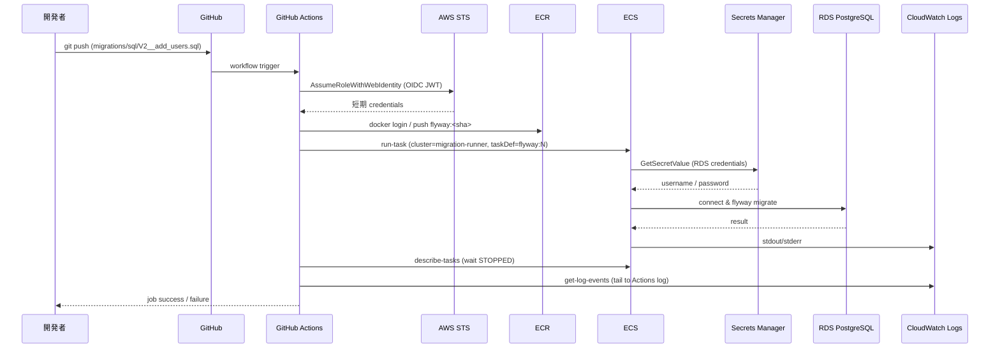

# アーキテクチャ

## 1. 全体像 (ASCII)

```
┌────────────────────────────────────────────────────────────────────────────────┐
│ GitHub                                                                         │
│   ┌─────────────────────────────────────────────────────────────┐              │
│   │ Repository: ecs-migration-runner                            │              │
│   │   migrations/sql/V*__*.sql  (Flyway SQL)                    │              │
│   │   .github/workflows/migrate.yml                             │              │
│   └────────────┬────────────────────────────────────────────────┘              │
│                │ push to main / workflow_dispatch                              │
│                ▼                                                               │
│   ┌─────────────────────────────────────────────────────────────┐              │
│   │ GitHub Actions Runner (ubuntu-latest)                       │              │
│   │   1. checkout                                               │              │
│   │   2. configure-aws-credentials  ─── OIDC JWT ──┐            │              │
│   │   3. docker build / push to ECR                │            │              │
│   │   4. aws ecs run-task                          │            │              │
│   │   5. wait & fetch logs                         │            │              │
│   └────────────────────────────────────────────────┼────────────┘              │
└──────────────────────────────────────────────────── │ ──────────────────────────┘
                                                     │ sts:AssumeRoleWithWebIdentity
                                                     ▼
┌──────────────────────────────── AWS アカウント ─────────────────────────────────┐
│                                                                                │
│  ┌─── IAM ─────────────────────────────────────────────────────────────────┐  │
│  │  OIDC Provider (token.actions.githubusercontent.com)                    │  │
│  │  GitHubActionsRole  ── ECR push / ECS run-task / iam:PassRole 限定      │  │
│  │  ECSTaskExecutionRole ── ECR pull, Logs write, SecretsManager read      │  │
│  │  FlywayTaskRole      ── 最小 (タスク内から AWS API 呼ばない)            │  │
│  └─────────────────────────────────────────────────────────────────────────┘  │
│                                                                                │
│  ┌─── VPC (10.0.0.0/16) ───────────────────────────────────────────────────┐  │
│  │                                                                         │  │
│  │  Public Subnet (10.0.0.0/24, AZ-a)                                      │  │
│  │     └─ NAT Gateway ──── Internet Gateway                                │  │
│  │                                                                         │  │
│  │  Private Subnet × 2 (10.0.10.0/24 AZ-a, 10.0.11.0/24 AZ-b)              │  │
│  │     ├─ ECS Fargate Task (Flyway, one-shot)                              │  │
│  │     │     │ ENV: FLYWAY_URL / FLYWAY_USER / FLYWAY_PASSWORD             │  │
│  │     │     │      (Secrets Manager から注入)                             │  │
│  │     │     ▼                                                             │  │
│  │     └─ RDS PostgreSQL (Multi-AZ off / db.t4g.micro)                     │  │
│  │                                                                         │  │
│  └─────────────────────────────────────────────────────────────────────────┘  │
│                                                                                │
│  ECR Repository (flyway-migration)                                             │
│  Secrets Manager (RDS 自動生成 secret)                                         │
│  CloudWatch Logs (/ecs/flyway-migration)                                       │
│                                                                                │
└────────────────────────────────────────────────────────────────────────────────┘
```

## 2. コンポーネント役割

| コンポーネント | 役割 |
|---|---|
| **GitHub Actions** | トリガー・ビルド・タスク起動・待機。`workflow_dispatch` と main push 両対応 |
| **OIDC Provider** | GitHub Actions に短期トークンを払い出す信頼基盤 |
| **GitHubActionsRole** | Actions が引き受ける IAM ロール。ECR push / ECS run-task / Logs read のみ |
| **ECR** | Flyway カスタムイメージの保管 (公式 `flyway/flyway` + SQL を COPY) |
| **ECS Fargate Task** | one-shot 起動。`migrate` コマンドを実行して終了 |
| **ECSTaskExecutionRole** | Fargate プラットフォームが ECR pull / Logs 書き / Secrets 取得に使う |
| **FlywayTaskRole** | コンテナ内部用。AWS API を呼ばないので最小 |
| **RDS PostgreSQL** | マイグレーション対象。private subnet に配置 |
| **Secrets Manager** | RDS マスター credentials を保持。ECS タスクが起動時に読み出す |
| **CloudWatch Logs** | Flyway の標準出力を保管 |

## 3. データフロー (シーケンス)



## 4. レイヤー依存

本プロジェクトは **インフラ + 1 コンテナ** で完結し、典型的な Handler/Service/Repository 構造は持たない。
将来アプリ本体を同居させる場合は CLAUDE.md のレイヤー規約に従う。

## 5. スタック分割の方針

```
[network-data スタック]                [app スタック]
  - VPC, Subnets, IGW, NAT             - ECR Repository
  - Security Groups                    - ECS Cluster
  - RDS DB Subnet Group                - ECS Task Definition
  - RDS Instance                       - IAM Roles (Task / Execution / GitHubActions)
  - Secrets Manager Secret (RDS自動)   - OIDC Provider
       │                                   │
       └───── Export ──────────────► Import (VPC, Subnets, SG, Secret ARN)
```

スタックを分けるのは **ライフサイクルが違う** から。
- network-data は DB を持つので壊しにくく、頻度低
- app はタスク定義の改訂で頻度高、削除しても DB は無事
